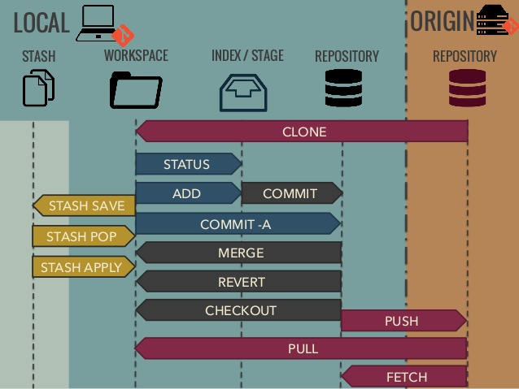

# Study

$ git init  
Create an empty Git repository or reinitialize an existing one  

$ git add . 
Adds the file to your local repository and stages it for commit. To unstage a file, use 'git reset HEAD YOUR-FILE'.  

$ git commit -m "Comment"  
Commits the tracked changes and prepares them to be pushed to a remote repository.  

$ git checkout (branch)  
Switch branches or restore working tree files  

$ git push origin (branch)  
Update remote refs along with associated objects  

$ git fetch (brance) 
Fetch ONLY. Manual merging  

$ git pull 
Fetch and Merge. Tracked branches  

Start a new Git repository for an existing code base  
$ cd /path/to/my/codebase 
$ git init      (1) 
$ git add .     (2) 
$ git commit    (3)  

(1) Create a /path/to/my/codebase/.git directory. 
(2) Add all existing files to the index. 
(3) Record the pristine state as the first commit in the history.  
