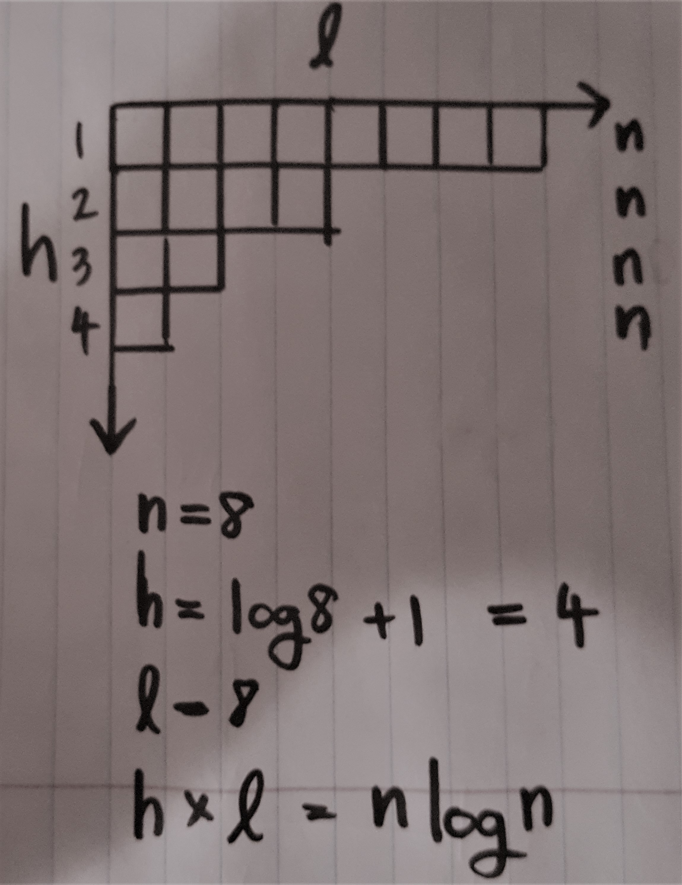

# Algorithm

A comparison sort algorithm cannot beat <strong><i>n * log(n)</i></strong> (worst-case) running time, since <strong><i>n * log(n)</i></strong> represents the minimum number of comparisons needed to know where to place each element.

