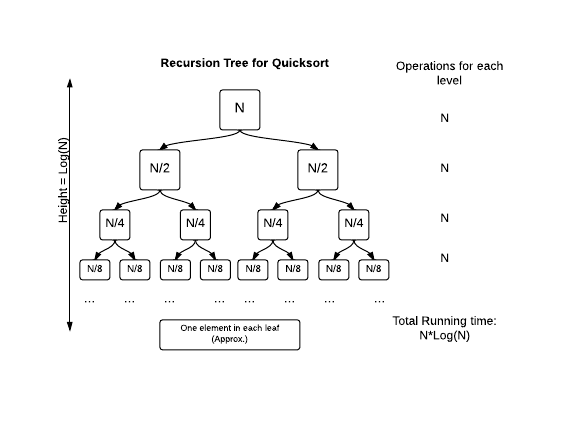
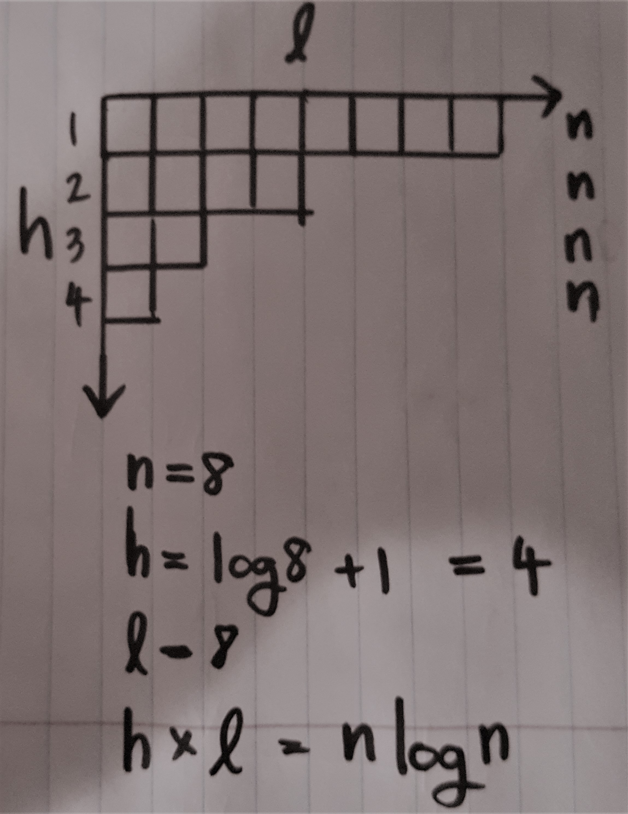

# Algorithm

A comparison sort algorithm cannot beat <strong><i>n * log(n)</i></strong> (worst-case) running time, since <strong><i>n * log(n)</i></strong> represents the minimum number of comparisons needed to know where to place each element.

**Use insertion sort for small subarrays:** 
Switching to insertion sort for small subarrays (length 15 or less,
say) will improve the running time of a typical mergesort implementation by 10 to 15
percent (see Exercise 2.2.23). 
**Test whether the array is already in order:** Exercise 2.2.8  
**Eliminate the copy to the auxiliary array:** Exercise 2.2.11  

