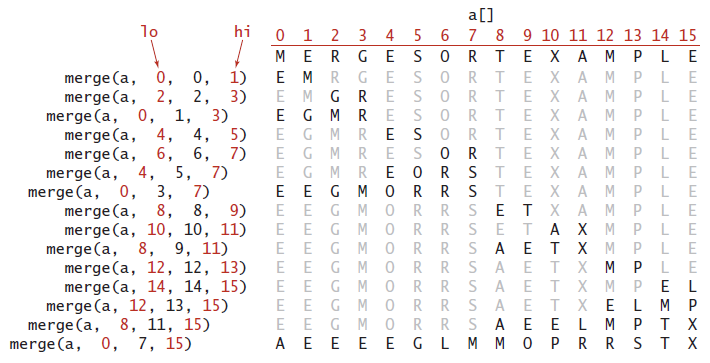
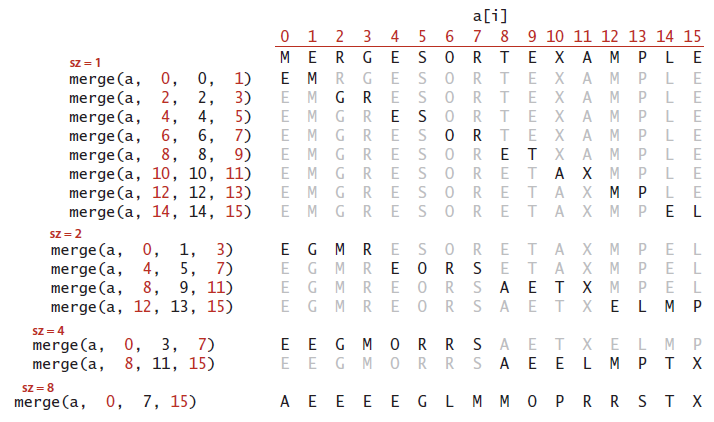

# Merge sort
	
**Top-down mergesort:** 1/2 NlogN ~ NlogN compares to sort an array of length N

**Proposition G.** Top-down mergesort uses at most 6N lg N array accesses to sort an
array of length N.

**Proof:** Each merge uses at most 6N array accesses (2N for the copy, 2N for the
merge back, and at most 2N for compares).

