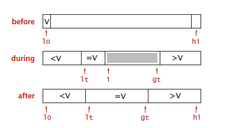

# QuickSort

A constant factor of 1.39N lg N whenever it is used to sort N items. The same is true of mergesort, 
but quicksort is typically faster because (even though it does 39 percent more compares)

Insertion Sort and the simple version of Quicksort were stable,   
but the faster **in-place** version of Quicksort was not (since it scrambled around elements while sorting).

<h3>To improve the performance</h3>

<h4>Cut off to insertion sort:</h4> 
`if (hi <= lo) return;` ==> `if (hi <= lo + M) { Insertion.sort(a, lo, hi); return; }`  
The optimum value of the cutoff M is system-dependent, but any value between 5 and 15 is likely to work well in most situations

<h4>Median-of-three partitioning:</h4>
Exercises2.3.18 and 2.3.19  

<h4>Entropy-optimal sorting:</h4> 
Quicksort with 3-way partitioning is entropy-optimal. 

Arrays with large numbers of dubplicated keys. For example, a subarray that consists solely of items that are equal does not
need to be processed further, but general quicksort keeps partitioning down to small subarrays.

