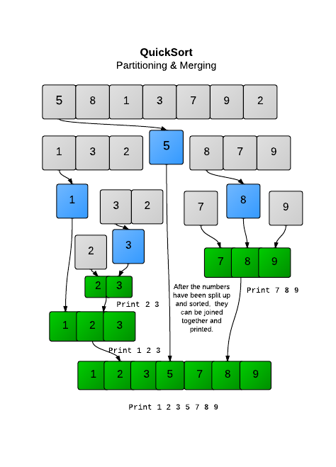

# QuickSort

A constant factor of 1.39N lg N whenever it is used to sort N items. The same is true of mergesort, 
but quicksort is typically faster because (even though it does 39 percent more compares)

Insertion Sort and the simple version of Quicksort were stable,   
but the faster **in-place** version of Quicksort was not (since it scrambled around elements while sorting).

<h4>To improve quick sort algorithm</h4>
<ul>
  <li>**Cut off to insertion sort:** if (hi <= lo) return;
in sort() with a statement that invokes insertion sort for small subarrays:
if (hi <= lo + M) { Insertion.sort(a, lo, hi); return; }</li>
  <li>**Median-of-three partitioning:** </li>
  <li>**Entropy-optimal sorting:** </li>
</ul>

